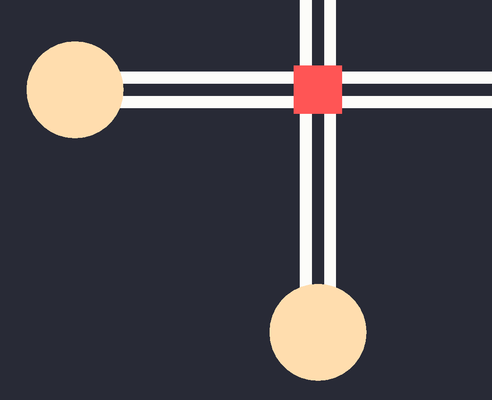
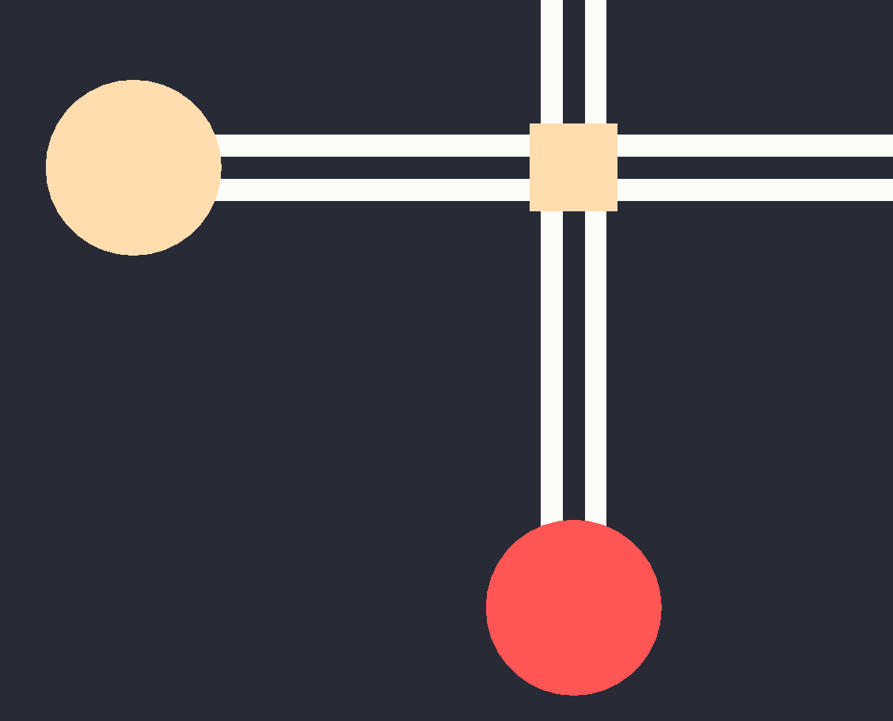
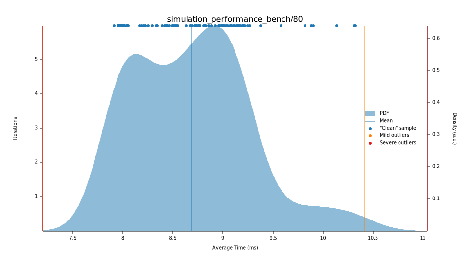
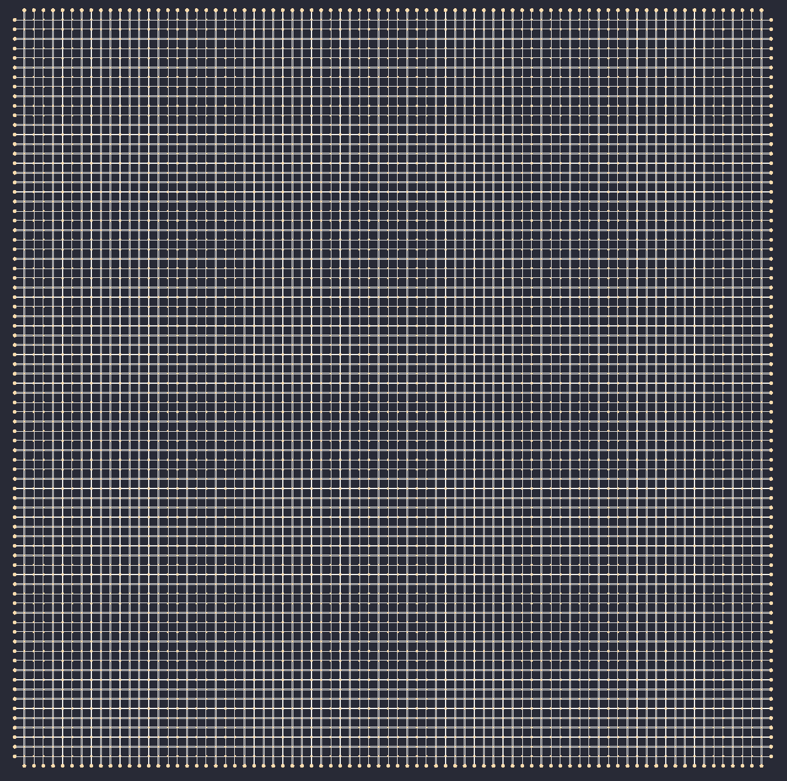

# AICO²
Submission to the Austrian competition "Ki-Wettbewerb" by Team Rusted.

A Street simulation that uses Neural Networks and a Genetic Algorithm to optimize the Traffic lights. It is possible to optimize the Street simulation either to be more economically friendly or to allow for maximum car speed. This can be changed in an intuitive-to-use Editor that is completely separate from the Backend to allow for maximum efficiency.

## Usage

In order to run this project, the rust programming language needs to be installed. To do so, follow the instructions on https://www.rust-lang.org/learn/get-started 

Afterwards, clone this github repository using
```bash
git clone https://github.com/Jodinandas/KI-Wettbewerb
```
If rust and its dependencies were installed properly (you may need to add it to $PATH), the program can be launched using (Note: compiling may take a while because all dependencies need to be installed first)
```bash
cargo run --release
```
(you need to be in the top-level  of the repository).

# The editor
TODO: Add image

The editor has two modes: the Street Editor mode and the simulation mode.

## Street editor mode

Here, the user can create a custom Street network fitting their needs. Theoretically, the network can be indefinetly large. However, we do not recommend very big sizes, because the optimization gets exponentially more difficult as the AI has to understand the coherence of all nodes. There are 3 NodeTypes available by default: 
* Crossings (standard: 4 Inputs and 4 Outputs)



* Streets (going only in one direction)


* I/O Nodes (the points where cars can enter or leave the Simulation)



### Moving around
Use the "pan" tool are navigate using W,A,S,D or the arrow keys. You can zoom in & out using Q, E or the scroll wheel.

### Adding crossings
Simply click the "add Crossing" tool on the right hand side and click on the canvas, where you want to place it.
### Adding I/O nodes
The same procedure as with Crossings
### Adding streets
When having selected the "add street" tool, they can be added by hovering over a Crossing or I/O Node and selecting the direction by clicking on the corresponding circle.

The output of the street is then determined in a similar manner.

### Changing attributes
By selecting the "select" tool and clicking on any Crossing or I/O Node, you can change their attributes.
* Crossings: The lane count can be determined for each steet. This essentially changes the (car-)capacity of the street.
* I/O Nodes: The spawn rate can be changed. This is the probability of the Node to spawn a new car each iteration. Values of 0.01 and below are recommended.

### Deleting crossings and I/O nodes

Using the "delete" tool, you can delete any Crossing or I/O node. The streets connected to it are automatically deleted.

## Simulation mode
Here, the created node network can be simulated. You can change the following parameters:

* Simulation delay: Useful to watch the movement of the cars. All simulations are waiting this amount of time after each step.
* Optimization target: Choose between optimal speed or optimal environmental impact
+ Time step in seconds: How many seconds in the real world are simulated each step. Low values produce more accurate simulations.
* Population size: The amount of different genomes for the Genentic Algorithm to try each iteration. Values above 500 are recommended
* Iterations to stop: How many iterations to perform before calculating the success of a specific genome
* Mutation chance: The mutation chance for a single Chromosome. Recommended value <0.001
* Mutation coefficient: The coefficent to apply to the randomly generated mutation. Recommended value <0.1
* Disable tracking [...]: Do not show the movables in the frontend. This will greatly improve performance.

After clicking the "Start Simulation" button, the different generational reports can be watched in the "Generation Report" window in the lower part of the window. You will need to resize it first (hover over the edge over "Generation Report" and drag it upwards).

## Preferences
For those of you who like to destroy their eyes, there is also a light mode available. You can change it in the simulation tab

## File dialog
Currently, you can not change the output dir. Files that are loaded or saved are located in the repository root under the name `StreetSimulation.json`.

# The internal project structure
## Why use a language like Rust when there is Python? 
While Python is **great** for most machine-learning related tasks, we needed to write
a simulation and could not just use state-of-the-art libraries like `tensorflow`, `keras` etc. In addition, one of our main goals when planning this project was to learn something new.

Because we already knew how to use Python, we decided to complement our knowledge with
a strongly-typed language. Rust provides a great package manager and an ingenious way
to install packages and document dependencies (They are listed along with their versions
in the file `Cargo.toml` )
## The top level structuring
The frontend and backend are completely separated. You could compile the backend
without having the frontend crate. This is partly because we want to maximise
performance. This means, the backend doesn't need (and shouldn't know) where
nodes are situated on the screen etc.

## About the `editor` folder
The folder called "editor" is a deprecated version of the frontend, written in python.

We changed to a version written in Rust because we wanted to write the
backend in Rust anyways. In addition, the communication between frontend and backend would
have been much harder.
## How to compile the documentation
Rust has a built-in way to generate a website with descriptions for all methods, structs
and other documentated parts of the crate (how a package is called in rust). To
generate the documentation for the frontend, run 
```bash
cargo doc --open -p editor-rs
```
For the backend
```bash
cargo doc --open -p simulator
```
For the Neural Network
```bash
cargo doc --open -p art-int
```
This can take a while, as `cargo` includes the documentation of all dependencies.
Once finished, it should automatically open the documentation in the browser.

The documentation generated by cargo in this project is meant to be used when
editing the code. It does not contain general information about the structure of
this project. The structure is documented and explained in this file.

## How the frontend works under the hood
### The frameworks
To display the simulation, we use [Bevy](https://bevyengine.org/) a 
game engine making use of the ECS (Entity - Component - System) pattern. 
This kind of game engine uses a way to group together data that can be
a bit annoying sometimes, but has the benefit of optimizing performance.

Bevy can be hard to use, because there is not a lot of documentation as the
engine is still early in developement. [The Unofficial Bevy Cheat Book](https://bevy-cheatbook.github.io/programming/queries.html) was a great help.

The UI is drawn using [egui](https://github.com/emilk/egui).

As both frameworks theoratically support WASM, our project could probably be compiled
for Browsers. 

## The Backend
### SimManager
The top level struct that interfaces with the frontend is called `SimManager`. Its purpose
$-$ as the name suggests $-$ is to provide a convenient way to generate simulations. 
Its main purposes is to collect updates from the simulations running in parallel. Because
the Simulations are running in a different thread, it is not possible to access the underlying
data directly. Instead [`std::sync::mpsc::Channel`](https://doc.rust-lang.org/book/ch16-02-message-passing.html) is used to send updates about a marked simulation to the 
Sim Manager. The frontend can then access the Receiver to get an idea of where cars are.

### SimulatorBuilder & Simulator
The main task of the simulator builder is to seperate the task of building a street
network into a different struct to keep the `Simulator` struct clean. It
can do things like connecting crossings etc.
The Simulator only knows how to perform the Simulation and not how to build one.

### $\rightarrow$ NodeBuilder & Node
The NodeBuilder is responsible for generating new nodes. Like in the relation
(Simulatorbuilder $-$ Simulator), it separates setting options from the core
functionality.

A Node is an enum that records the different variants of interactable objects in the scene.
```rust
pub enum Node<Car = RandCar>
where
    Car: Movable,
{
    /// Wrapper
    Street(Street<Car>),
    /// Wrapper
    IONode(IONode<Car>),
    /// Wrapper
    Crossing(Crossing<Car>),
}
```

The `IONode` is responsible for spawning new cars to the simulation and for destroying
old cars, when they reach their destination.

-------

The `Street` connects `Crossings` 

------

A `Crossing` is responsible for controlling the traffic light state. For this reason, it
is the component that uses a neural network internally. 

------

### $\rightarrow$ MovableServer
The Movable server is a part of the `Simulator` is responsible for creating new cars and generating a path for
them. In addition, it is able to cache the generated cars to avoid having to compute
a new path for every single car. This means that after a few generations at maximum,
the computation of new cars becomes only a matter of copying an old car and
giving it a new id.

### The genetic algorithm
A unique neural network is generated for each simulation to ensure it trains
on the exact situation it would otherwise encounter in real life.

### The cost function
To estimate the amount fuel a car consumes, we use the polynomial
$$ \text{Fuel}_{liters}(x) = -0.000000000138841 x^6 + 0.000000049189085x^5 \\ - 0.000006513465616x^4 + 0.000375629640659x^3 \\ - 0.005677092214215x^2 - 0.300161202539628x \\ + 15.954046194749404$$
where $x$ is the average speed of the car.

We modelled it after the graph [this article](https://theconversation.com/climate-explained-does-your-driving-speed-make-any-difference-to-your-cars-emissions-140246) using Geogebra.


## Performance
To simulate a grid of 80 by 80, the simulator (without the frontend) takes about 9ms per iteration step (depending on the setting a ~2-10 second advancement in the simulation time). In practise, the time should be even better as this is the performance
of one simulation. When simulating on a multicore processor, you can simulate one Simulator per thread. (For the
test, a Ryzen 7 2700X was used. OS: Arch Linux)





# Challenges
While some Rust crates like rayon (for parallel iterators) and tracing (for logging)
are great, crates like bevy and egui are extremely cumbersome to use. 
This is one of the reasons, why the frontend is rather simple and some functions
are not quite working.
E.g.: Unfortunatly, when advancing to a new generation, there are still graphical bugs in the frontend (lingering cars).

Sometimes (especially with bigger simulations), the genetic algorithm will fail. This is
something we are aware of, but haven't found the time yet to deal with. It could probably be ironed out
by investing more time into formulating a better cost function. (Fortunatly, the simulation itself
is fast even for bigger simulations)


